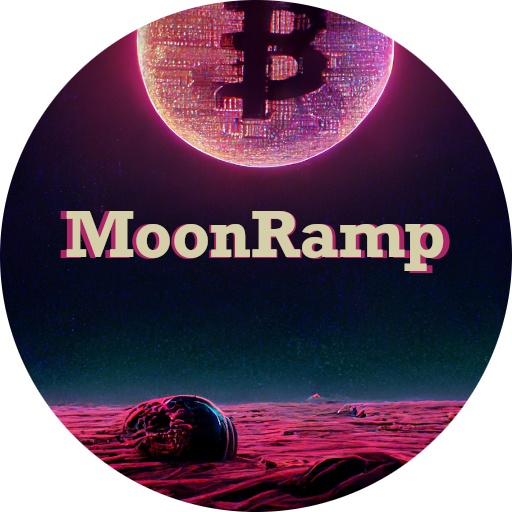

# Moonramp



Start accepting crypto payments without fees or 3rd parties for your buisness or personal use today.

This project is free and open-source software that fully embraces Satoshi's vision of peer-to-peer digital cash.

## WORK IN PROGRESS

=================
Early alpha state
=================

!! Not all features are ready !!

## Features
* BTC, BCH, ETH (+ERC-20 tokens), and XMR support
* Supports hot and cold wallets
* HD wallets
* Multi-layered encryption schema for SAFU funds
* Multi-tenant support
* Role base access control
* JsonRpc API
* Programmable contract system (Wasm based)
* SQL backend support (Mysql, Postgres, SQLite)
* Stand-alone reproducable statically linked binaries

## Install

### Native

#### Step 1

[Install Rust](https://www.rust-lang.org/)

#### Step 3

```
git clone git@github.com:MoonRamp/moonramp.git
```

#### Step 3

```
cd moonramp && cargo build --release
```

### Docker Image

```
FROM moonramp/moonramp:0.1.0
```

### Download pre-built binaries

https://github.com/MoonRamp/moonramp/releases

## Setup guide

## Donate

If you want to contribute to the project you can donate monero or bitcoin.
Donations will fund the development and marketing of the project.

### XMR

468ZeZpnUdfXjkzvzt1QBcA5SU1coDg1z7CtKhzixfQabT1zUQt6YivN7XAAGbUzt4i6hXqkNTc82TzAG4FiLag1GK7xPSk

### Bitcoin

bc1qefwe0jnue2327zjpef8e80ndyt24xjsqgt33ek

